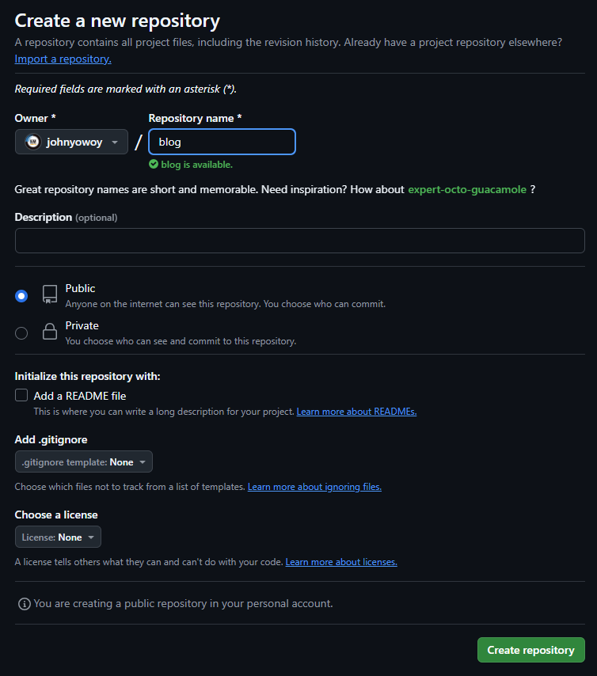

# 🚀 告別本地！將 Docusaurus 網站部署到 GitHub Pages 實戰
經歷了前期的環境準備與內容撰寫，現在我們終於要將靜態網站 Docusaurus 搬上雲端！
GitHub Pages 提供了**免費、穩定且與 Git 工作流程高度整合**的靜態網站託管服務，是部署技術筆記的最佳選擇之一。
這篇文章將帶您走完所有關鍵步驟，讓您的 Docusaurus 網站快速上線！
:::info
**【部署前準備：Check List】**
請確認您的電腦環境已具備以下條件：
1.  已安裝 **Node.js**、**npm**、**yarn** 或 **pnpm/Bun**。
2.  擁有一個 **GitHub 帳號**。
3.  已經**建立並初始化** Docusaurus 網站（例如：專案名稱為 `my-website`）。
:::

## Step1. 建立 GitHub 遠端倉庫（Repository）
這是專案版本控制與部署的基礎。
1.  登入您的 GitHub 帳號。
2.  點擊右上角的 **+** 按鈕，選擇 `New repository`。
3.  輸入您的專案名稱，例如：`johnyowoy-website`。
4.  確認設定為 **Public**（或您希望的權限），然後點擊 `Create repository`。


## Step2. 核心設定：配置 Docusaurus 支援 GitHub Pages
這一步是部署成功的關鍵！我們必須在 Docusaurus 的配置檔中，明確告訴它網站部署的位置和路徑。
在您的 Docusaurus 網站目錄中，打開 `docusaurus.config.js` 文件，修改以下配置：
```JavaScript=
    ...
    ...
    ...
const config = {
  title: 'JOHNYOWOY',
  tagline: 'This is my BLOG ^^',
  favicon: 'img/myIcon.png',

  // Set the production url of your site here
  url: 'https://<your-github-username>.github.io', // 例如：https://johnyowoy.github.io
  // Set the /<baseUrl>/ pathname under which your site is served
  // For GitHub pages deployment, it is often '/<projectName>/'
  baseUrl: '/<repository-name>/', // 例如：/johnyowoy-website/

  // GitHub pages deployment config.
  organizationName: '<your-github-username>', // 例如：johnyowoy
  projectName: '<repository-name>', // 例如：johnyowoy-website
  deploymentBranch: 'gh-pages',
    ...
    ...
    ...
    ...
};
```
:::warning
🔥必讀重點：url 與 baseUrl 的差異
* url：定義網站的網域根目錄，主要影響 SEO 和 Sitemap 資訊。
* baseUrl：定義網站資源的前置路徑。因為 Project Site 的實際路徑是 [Domain]/[Repo Name]/，所以 baseUrl 必須設定為倉庫名稱 /repository-name/，否則您的 CSS/圖片等資源會找不到路徑！
:::

## Step3. 初始化 Git 倉庫與提交程式碼
在部署前，我們需要將本地專案與遠端倉庫連結，並確保排除掉不必要的檔案。
:::info
確保 .gitignore 檔案存在！
如果您使用的是 Docusaurus 經典模版，通常會自動生成 .gitignore。此檔案的目的是排除編譯的輸出 (/build) 和依賴套件 (/node_modules)，確保只上傳原始碼。
請確認您的 .gitignore 包含以下關鍵行：
```
# Dependencies
/node_modules

# Production
/build

# Generated files
.docusaurus
.cache-loader

# Misc
.DS_Store
.env.local
.env.development.local
.env.test.local
.env.production.local

npm-debug.log*
yarn-debug.log*
yarn-error.log*
```
:::

打開終端機 (或 PowerShell)，運行以下命令初始化 Git 並推送程式碼：
```powershell=
cd <your Docusaurus Project>
git init
git add .
git commit -m "upload my first blog."
git branch -M main
git remote add origin https://github.com/<your github account>/<your repository>.git
git push -u origin main
```

## Step4. 運行部署指令：Deploy！
Docusaurus 內建了強大的部署腳本，可以一鍵完成編譯 (Build) 和推送到 deploymentBranch 的工作。
運行以下命令來部署你的Docusaurus網站到 GitHub Pages：
```powershell=
GIT_USER=<your github account> yarn deploy
```
例如，如果你的GitHub帳號是 johnyowoy，那麼命令應該是：
```powershell=
GIT_USER=johnyowoy yarn deploy
```
執行成功後，Docusaurus 會自動執行以下流程：
執行 npm run build，將網站建構到 /build 目錄。
使用 docusaurus deploy 腳本，將 /build 目錄的內容推送到您設定的 gh-pages 分支。
🎉 網站存取連結
現在，您的 Docusaurus 網站已成功部署到 GitHub Pages，並可以通過以下連結進行訪問（可能需要等待幾分鐘讓 GitHub Pages 完成部署設定）：
```
https://<your-github-username>.github.io/<repository-name>/
```
###### 參考資料
[Create & Deploy Your Website Quickly - Docusaurus & GitHub Pages - YouTube](https://youtu.be/9iVNf0T09dE?si=2EpGvYwqDTuWG5Da)